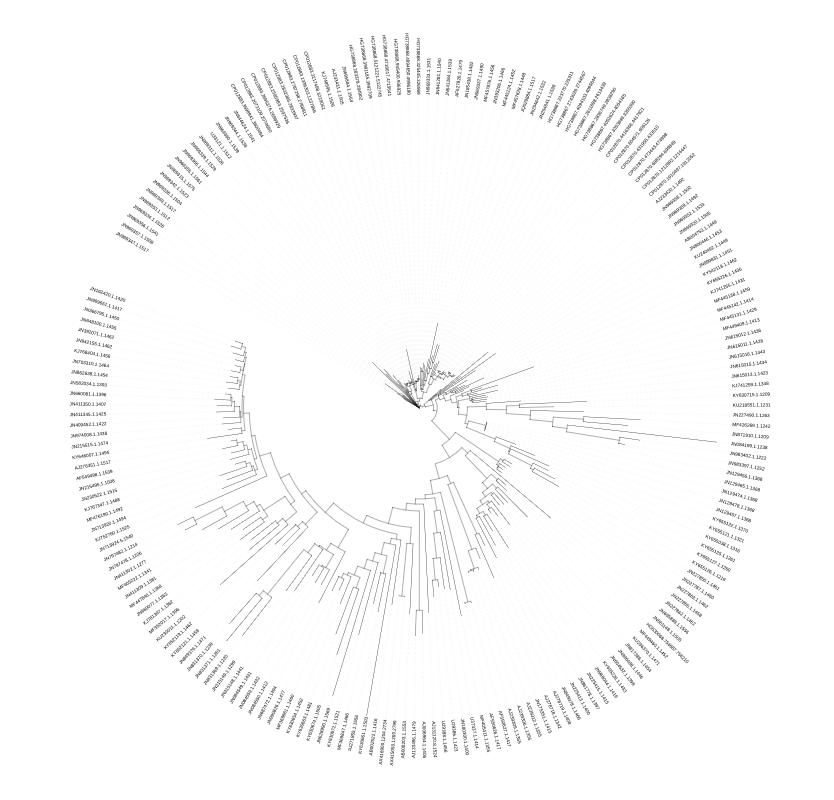
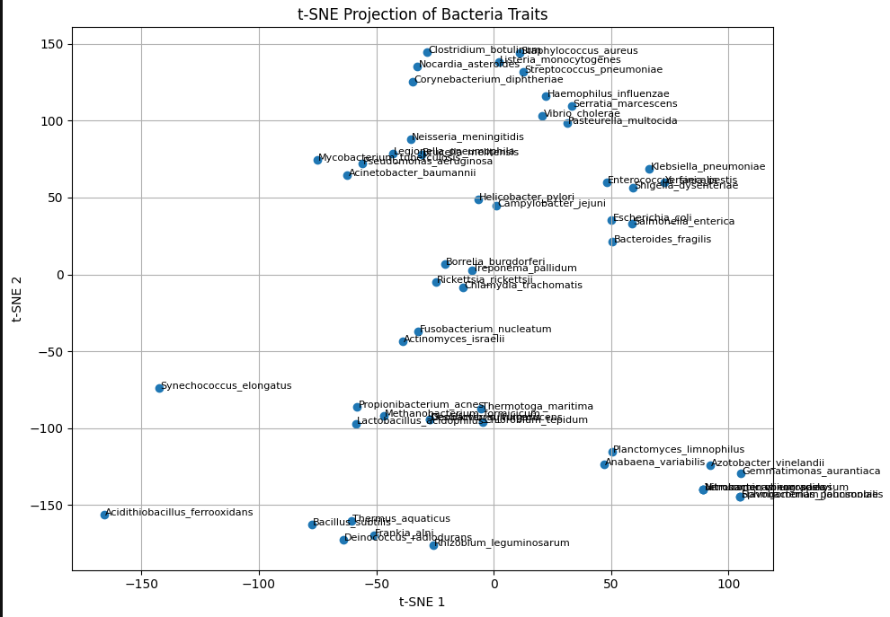

# PhyloTrait

**Phylogenetic Tree and Trait-Based Clustering of Bacterial Species Using 16S rRNA**

This project presents a pipeline for constructing a phylogenetic tree of bacterial species based on 16S rRNA sequences and enriching the analysis with species-level trait metadata.

Designed to demonstrate a practical intersection of **bioinformatics**, **unsupervised learning**, and **molecular evolution**.


---

## 🧬 Objectives

- Fetch 16S rRNA sequences of 50+ bacterial species from the SILVA database
- Align sequences using MUSCLE and construct a phylogenetic tree
- Visualize evolutionary relationships
- Analyze biological traits (Gram status, shape, oxygen use) via dimensionality reduction and clustering

---

## 🧪 Technologies Used

| Tool               | Purpose                             |
|--------------------|-------------------------------------|
| **Python**         | Core scripting and analysis         |
| **Biopython**      | Sequence handling, tree building    |
| **MUSCLE**         | Multiple sequence alignment         |
| **iTOL**           | Tree visualization                  |
| **scikit-learn**   | Clustering and dimensionality reduction |
| **pandas, matplotlib** | Trait analysis and plotting   |

---

## 📁 Project Structure

```bash
main/
│
├── data/
│   ├── aligned/aligned.fasta            # Aligned sequences for tree construction
│   ├── selected_bacteria.fasta          # Raw FASTA sequences
│   ├── species.txt                      # List of species used
│   └── traits.csv                       # Categorical metadata for clustering
│
├── notebooks/
│   ├── analysis.ipynb                   # Exploratory data analysis, tree insight
│   └── trait_based_clustering.ipynb     # t-SNE + clustering visualization
│
├── Results/
│   ├── cluster.png                      # Clustering visualization
│   ├── tree.nwk                         # Newick-format phylogenetic tree
│   ├── tree.png                         # Static tree visualization (screenshot)
│   ├── tree_s1.png / s2.png / s3.png    # Additional stylized trees (screenshot)
│
└── scripts/
    ├── fetch_sequences.py               # Data gathering automation
    └── build_tree.py                    # Core logic for phylogenetic tree building

```


---

## 🚀 Pipeline Summary

### 1. **Sequence Retrieval**
> Using Biopython and SILVA-formatted files, the project filters and extracts 16S rRNA sequences from 50+ species.

### 2. **Alignment & Tree Construction**
- MUSCLE aligns all sequences
- Distance matrix computed using identity
- Tree built using **Neighbor-Joining (NJ)** algorithm  
- Exported in **Newick format** for visualization

### 3. **Tree Visualization**
- Trees are visualized using **iTOL** or via static PNG exports from Biopython

### 4. **Trait-Based Clustering**
> The `traits.csv` file includes categorical biological features:
- **Gram Status**: Positive / Negative
- **Oxygen Requirement**: Aerobic / Anaerobic / Facultative
- **Shape**: Cocci / Bacilli / Spiral

These are encoded and projected using **t-SNE**, revealing natural groupings based on traits.

---

## 📊 Sample Results

- `tree.png`: Full phylogenetic tree


- `cluster.png`: t-SNE clustering based on traits


- Additional filtered trees: `tree_s1.png`, `tree_s2.png`, etc.

---

## 📄 Instructions (Command History)

Commands used across stages (also recorded in `notebooks/analysis.ipynb`):

```bash
# Fetch sequences
python scripts/fetch_sequences.py

# Align sequences
muscle -in data/selected_bacteria.fasta -out data/aligned/aligned.fasta

# Build tree
python scripts/build_tree.py
```

---

## 🧠 Notes

- Trait enrichment helps relate genetic similarity to phenotypic/functional traits
- The tree and clustering provide complementary insights into bacterial diversity
- Project is modular and extendable (e.g., add more traits, try hierarchical clustering, apply PCA)

--- 

